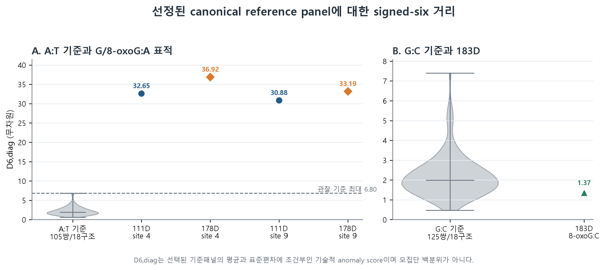
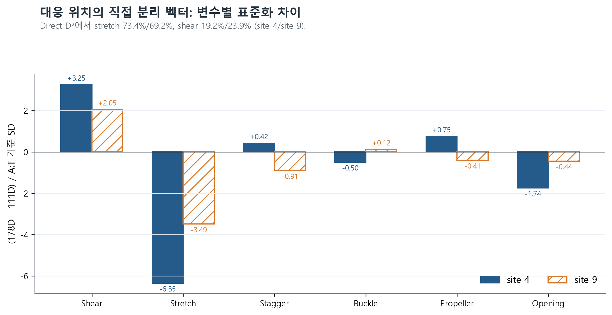
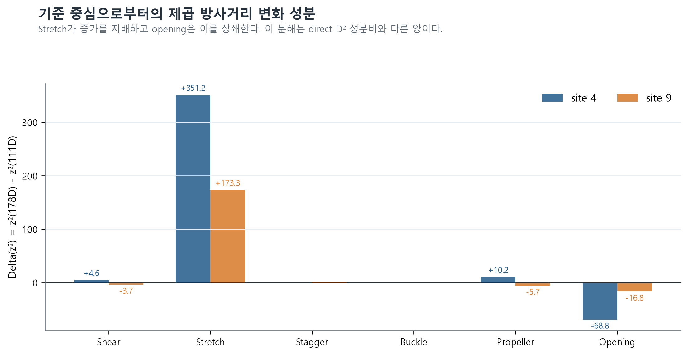

# 8-oxoG:A matched-structure analysis

> **연구 질문:** 8-oxoG:A의 큰 염기쌍 내부 구조 이탈은 산화 특이적인가?

이 저장소는 정상 B-DNA 구조공간과 두 대응 결정구조를 같은 계산 규칙으로 비교하고, 결론이 특정
변수와 기준패널에 얼마나 의존하는지 검증한 코드·입력표·결과표를 공개한다. 최종 결론은 산화의
일반적 인과효과가 아니라 **이 matched case에서 관찰된 stretch 중심의 조건부 추가 차이**이다.

## 1분 요약

- 정상 B-DNA 기준패널: 18개 X-ray 구조, canonical A:T 105쌍과 G:C 125쌍
- 주 비교: 111D의 G:A와 178D의 8-oxoG:A, 대응 위치 site 4와 site 9
- 측정값: DSSR의 여섯 pair-internal parameter
  (`shear`, `stretch`, `stagger`, `buckle`, `propeller`, `opening`)
- 핵심 절차: 동일 DSSR 재계산 → 염기쌍 방향 정규화 → 정상 기준공간 표준화 → radial/direct
  distance 분리 → 변수·구조·family·품질 민감도 분석
- 두 구조 모두 정상 A:T 기준에서 매우 크게 이탈했다. 따라서 **큰 이탈 자체**는 8-oxoG에
  고유하다고 볼 수 없다.
- signed-six radial distance의 `178D − 111D`는 site 4에서 `+4.269`, site 9에서 `+2.308`이었다.
- 두 표적의 direct standardized distance는 각각 `7.410`, `4.194`였다.
- direct distance 제곱에서 stretch의 비중은 각각 `73.44%`, `69.24%`였다.
- stretch를 제외하면 radial 차이는 `−1.295`, `−0.628`로 두 자리 모두 방향이 역전되었다.



이 민감도 결과 때문에 초기의 “8-oxoG:A가 변수 전반에서 더 크게 이탈한다”는 해석을 유지하지
않았다. 허용되는 해석은 “두 구조의 큰 이탈은 공통적이고, 178D의 추가 차이는 이 matched
comparison에서 stretch에 집중되어 있다”이다.



위 그림은 111D와 178D **사이의 direct distance**를 분해한다. 아래 그림은 기준 중심에서 각
표적까지의 **radial distance 제곱 변화**를 분해하므로 같은 양이 아니다.



## 가장 빠른 재현

Python 3.12에서 다음 명령을 실행한다. 이 경로는 공개된, 방향 정규화가 완료된 pair-level CSV부터
시작하므로 DSSR 설치가 필요 없다.

```powershell
python -m venv .venv
.\.venv\Scripts\python.exe -m pip install -r requirements.txt
.\.venv\Scripts\python.exe run_analysis.py
.\.venv\Scripts\python.exe -m unittest discover -s tests -v
.\.venv\Scripts\python.exe scripts\preflight_publication.py
```

macOS/Linux에서는 위 명령의 `.venv/Scripts/python`을 `.venv/bin/python`으로 바꾼다.

정상 실행의 핵심 출력은 다음과 같다.

```text
PASS: 19/19 validation checks
signed-six radial delta D: site 4 = +4.269, site 9 = +2.308
direct standardized distance: site 4 = 7.410, site 9 = 4.194
omit-stretch radial delta D: site 4 = -1.295, site 9 = -0.628
Conclusion gate: stretch-centered interpretation supported
```

코드 없이 흐름을 확인하려면 실행 결과가 저장된
[`notebooks/final_signed_six_reproduction.ipynb`](notebooks/final_signed_six_reproduction.ipynb)를 연다.

## 원자 좌표부터 다시 실행

전체 경로는 공식 RCSB mmCIF를 내려받아 같은 DSSR 실행조건으로 재계산한다. DSSR 실행파일은
라이선스가 별도인 외부 프로그램이므로 이 저장소에 포함하지 않는다. Node.js 18+, Python 3.12,
별도로 받은 DSSR이 필요하다.

```powershell
.\.venv\Scripts\python.exe run_full_pipeline.py --dssr-path "C:\path\to\x3dna-dssr.exe"
```

고정한 실행조건은 DSSR `v2.9.1-2026jul09`, 옵션
`--more --json --nt-mapping=8OG:g`이다. 입력 URL·다운로드 시각·크기·SHA-256은
[`config/input_manifest_full_v1.csv`](config/input_manifest_full_v1.csv)에, 실행환경은
[`config/runtime_manifest_full_v1.json`](config/runtime_manifest_full_v1.json)에 기록했다.
결정품질 감사용 wwPDB validation XML 21개도
[`config/validation_manifest_2026-08-04.csv`](config/validation_manifest_2026-08-04.csv)의
크기·SHA-256과 일치해야 다음 단계로 진행한다.
전체 경로의 기준 실행은 Windows 11용 DSSR 실행파일의 정확한 SHA-256까지 고정한다. 따라서
macOS/Linux에서는 빠른 재현 경로를 사용하거나, 다른 DSSR 바이너리를 별도 환경 민감도로
검증해야 하며 같은 실행파일 재현이라고 표현하지 않는다.

## 저장소 안내

| 경로 | 역할 |
|---|---|
| `run_analysis.py` | 공개 pair table에서 핵심 수치와 변수 제외 민감도를 재생성하는 빠른 경로 |
| `run_full_pipeline.py` | RCSB 좌표 다운로드부터 DSSR·QC·분석·그림까지 연결하는 전체 경로 |
| `scripts/` | 좌표 수집, DSSR 실행, 방향 정규화, 분석, 민감도, 그림 생성 코드 |
| `data/processed/` | 빠른 경로의 pair-level 입력 |
| `data/quality/` | 표적 매핑, 방향 정규화, 183D 대칭 처리의 감사표 |
| `results/generated/` | `run_analysis.py`가 재생성한 핵심 결과 |
| `results/reference/` | 확장 민감도 분석과 구조 검색의 고정 결과 |
| `results/figures/` | 원고용 그림과 그림 3의 입력표 |
| `historical/2026-05/` | 2026년 5월에 작성된 초기 탐색·분석 코드의 보존본 |
| `tests/` | 핵심 수치, 방향 변환, 183D 대칭 중복 처리의 회귀검사 |

결과 주장과 파일의 정확한 대응은
[`docs/RESULT_TO_FILE_MAP.md`](docs/RESULT_TO_FILE_MAP.md), 수학적 정의와 분석 흐름은
[`docs/METHODS.md`](docs/METHODS.md)에서 확인할 수 있다.

## 질문과 방법의 발전

2024년에는 DNA 이중나선 형태를 곡률로 수치화하는 데서 출발했다. 2025년에는 DNA damage와
guanine oxidation을 검토하며 8-oxoG 질문을 형성했다. 2026년에는 111D와 178D의 matched
structure comparison을 설계했고, 8월 재계산에서는 세 변수 절댓값 중심 분석을 signed-six로
확장하고 radial distance와 direct distance를 분리했다. 변수 제외 분석에서 stretch 의존성을
확인한 뒤 결론의 범위를 좁혔다. 자세한 시점 구분은
[`RESEARCH_TIMELINE.md`](RESEARCH_TIMELINE.md)에 기록했다.

## 해석 범위

이 저장소가 지지하는 것은 공개 구조 두 개를 이용한 **구조 사례의 재해석**이다. 111D와 178D는
각각 하나의 독립 결정구조이며 한 구조 안의 site 4와 site 9는 독립 생물학적 반복이 아니다.
따라서 모집단 수준의 산화 효과, 기능 변화, 돌연변이율 또는 복구효소 인식의 인과효과를 추정하지
않는다. 추가 한계는 [`KNOWN_LIMITATIONS.md`](KNOWN_LIMITATIONS.md)에 명시했다.

## 데이터와 외부 소프트웨어

원자 좌표는 RCSB Protein Data Bank의 공개 mmCIF에서 얻었다. 좌표 원문과 DSSR 실행파일은
저장소에 재배포하지 않고, 다운로드 manifest와 파생 pair table을 제공한다. 출처·재배포 범위와
라이선스 상태는 [`DATA_AND_SOFTWARE_NOTICE.md`](DATA_AND_SOFTWARE_NOTICE.md)를 따른다.
